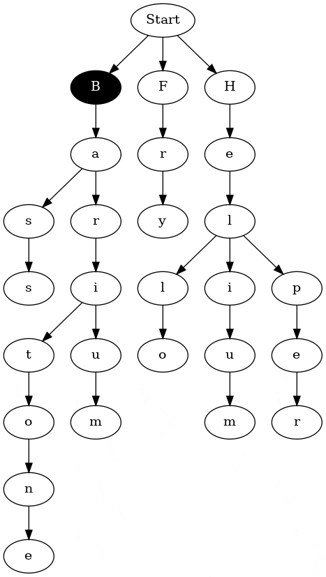

# trie
toy implementation of a [Trie/Prefix Tree](https://en.wikipedia.org/wiki/Trie)

## Requirements

- [Steel Bank Common Lisp](http://www.sbcl.org/)

## Building Examples

Use the build script `./build-example.sh` to create example binaries with SBCL:

```console
$ ./build-example.sh examples/graph.lsp  # build the executable `graph` in the repository root.
```

## Examples

### Graphviz DOT File (graph.lsp)

#### Additional Requirements
- Graphviz

Prints a [DOT language](https://graphviz.org/doc/info/lang.html) representation
of the input dictionary to standard output.

```console
$ ./build-example.sh examples/graph.lsp  # build `graph` executable
$ ./graph $filename > trie.dot           # using `filename` as input, save DOT output to 'trie.dot'
$ dot -Tsvg trie.dot -O                  # create SVG using 'trie.dot' as input
```

#### Input (included in dict/short.txt):

```
Helper
Helium
Hello
Fry
Barium
Baritone
Bass
```

#### Output

*Individual words highlighted for clarity*


