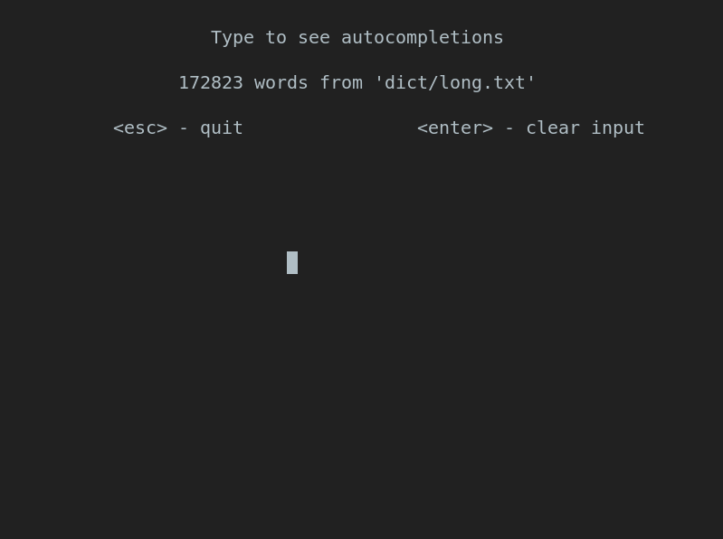

# trie
implementation of a [Trie/Prefix Tree](https://en.wikipedia.org/wiki/Trie)

## Requirements

- [Steel Bank Common Lisp](http://www.sbcl.org/)

## Building Examples

Use the build script `./build-example.sh` to create example binaries with SBCL:

```console
$ ./build-example.sh graph  # build the executable 'graph' in the repository root.
```

## Examples

### NCURSES Prediction (prediction.lisp)

Loads a dictionary file and presents a list of autocomplete suggestions using the user
input as the prefix to search for.

```console
$ ./build-example.sh prediction      # build 'prediction' executable
$ ./prediction --dict dict/long.txt  # run the demo using 'dict/long.txt' as the dictionary
```

Then, type to see autocomplete suggestions for the current input.

Use <kbd>Escape</kbd> to exit, and <kbd>Enter</kbd> to reset input.



### Graphviz DOT File (graph.lisp)

#### Additional Requirements
- Graphviz

Prints a [DOT language](https://graphviz.org/doc/info/lang.html) representation
of the input dictionary to standard output.

```console
$ ./build-example.sh graph.lisp  # build 'graph' executable
$ ./graph $filename > trie.dot   # using `filename` as input, save DOT output to 'trie.dot'
$ dot -Tsvg trie.dot -O          # create SVG using 'trie.dot' as input
```

#### Input (included in dict/short.txt):

```
Helper
Helium
Hello
Fry
Barium
Baritone
Bass
```

#### Output

*Individual words highlighted for clarity*


